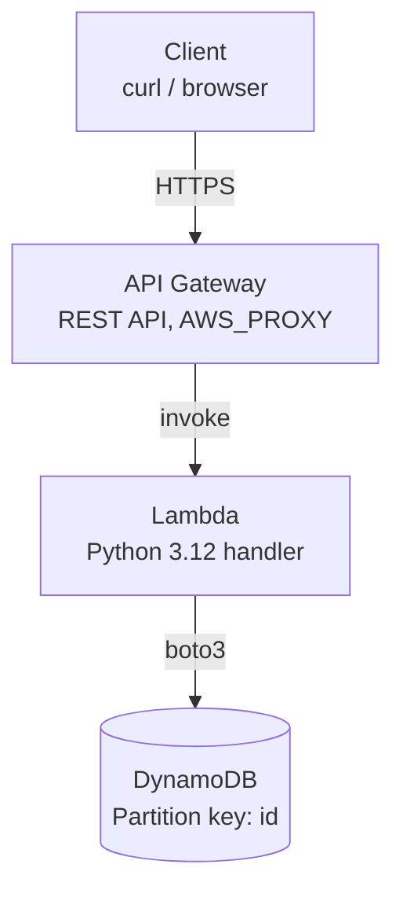

# Serverless CRUD API (API Gateway + Lambda + DynamoDB)

A serverless REST API for managing items, built with Terraform. API Gateway
routes requests to a Python Lambda function, which reads and writes to a
DynamoDB table.

This started from an AWS console-based tutorial and was rebuilt from scratch
as infrastructure-as-code, with a few deliberate improvements over the
original tutorial:

- **IAM scoped to one table** — the original tutorial's policy used
  `"Resource": "*"` for DynamoDB; this one is scoped to the specific table ARN.
- **Real REST routes** — `GET /items`, `GET /items/{id}`, `POST /items`,
  `PUT /items/{id}`, `DELETE /items/{id}` instead of a single `POST` endpoint
  that branched on an `"operation"` field in the request body.
- **Infrastructure as code** — the whole stack (IAM, Lambda, API Gateway,
  DynamoDB) is reproducible with `terraform apply`, not manual console clicks.

## Architecture



## Project structure
```
Serverless-crud-api/
├── README.md
├── .gitignore
└── terraform/
    ├── provider.tf
    ├── variables.tf
    ├── dynamodb.tf
    ├── iam.tf
    ├── lambda.tf
    ├── api_gateway.tf
    ├── outputs.tf
    ├── terraform.tfvars.example
    └── src/
        └── lambda_function.py
```
## Prerequisites

- [Terraform](https://developer.hashicorp.com/terraform/downloads) >= 1.5
- An AWS account and credentials configured locally (`aws configure` or
  equivalent environment variables)
- Python 3.12 (only needed if you want to test the handler locally)

## Deploy

```bash
cd terraform
cp terraform.tfvars.example terraform.tfvars
# edit terraform.tfvars if you want a different region/project name

terraform init
terraform plan
terraform apply
```

On success, Terraform prints `api_base_url`. Use that as the base for the
requests below.

## API usage

```bash
export API_BASE_URL="<value of api_base_url from terraform output>"
```

**Create an item**
```bash
curl -i -X POST "$API_BASE_URL/items" \
  -H "Content-Type: application/json" \
  -d '{"id": "1234ABCD", "number": 5}'
```

**List all items**
```bash
curl -i "$API_BASE_URL/items"
```

**Get one item**
```bash
curl -i "$API_BASE_URL/items/1234ABCD"
```

**Update an item**
```bash
curl -i -X PUT "$API_BASE_URL/items/1234ABCD" \
  -H "Content-Type: application/json" \
  -d '{"number": 10}'
```

**Delete an item**
```bash
curl -i -X DELETE "$API_BASE_URL/items/1234ABCD"
```

All five endpoints were tested end to end against a live deployment,
including confirming a `404` on `GET /items/{id}` after deletion.


## Clean up

```bash
cd terraform
terraform destroy
```

## Known limitations / next steps

- **No authentication.** Every route is open (`authorization = "NONE"`).
  Adding an API key (`aws_api_gateway_api_key` + usage plan) or a Cognito
  authorizer would be the next step for anything beyond a demo.
- **No input schema validation** beyond checking that `id` is present on
  create. API Gateway request validators, or a library like `pydantic`
  inside the handler, would tighten this up.
- **No automated tests or CI.** A `pytest` suite for the handler plus a
  GitHub Actions workflow (`terraform fmt -check`, `terraform validate`,
  tests, then `terraform plan` on PRs) would make this closer to
  production-grade.
- **Single Lambda for all operations.** Fine at this scale; splitting into
  per-operation functions would only be worth it if operations had very
  different resource needs.

## Why this design

Using one Lambda behind an `ANY` proxy integration (rather than a separate
API Gateway method + Lambda per operation) keeps the Terraform small and
mirrors how many real serverless APIs are built: routing logic lives in
application code, infrastructure stays generic. The trade-off is that route
logic isn't visible in the API Gateway console the way per-method
integrations would be — worth calling out if you present this project.